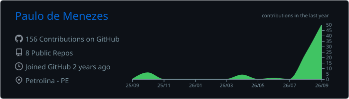

<div align="center">

# Paulo de Menezes Gonçalves

**Software developer focused on web, mobile, and backend development, currently expanding into cybersecurity.**

<a href="https://git.io/typing-svg">
  
</a>

<br />

<a href="https://paulodemenezesportfolio.vercel.app"></a>
<a href="https://www.linkedin.com/in/paulomenezesg"></a>
<a href="mailto:menezespaulo210@gmail.com"></a>

</div>

---

## About me

- 🎓 Studying **Systems Analysis and Development** at IFSertãoPE, with completed technical training in IT.
- 📱 Experienced in building cross-platform applications with **Flutter**, **Django**, and **PostgreSQL**.
- 🗃️ Worked with offline-first data collection, relational modeling, CRUD flows, functional testing, and technical documentation.
- 🧩 Interested in backend development, APIs, software architecture, automation, and developer tools.
- 🔐 Expanding my knowledge of cybersecurity and working toward a career that connects software engineering and security.

## Selected work

### Ministry of Sports data collection platform

**Technology Development Scholar · FADEX / IFSertãoPE Campus Ouricuri · Jun 2025 – Aug 2026**

Contributed to a field data collection platform designed to keep working in areas with limited or no connectivity.

- Built five operational CRUD flows covering people, classes, collections, centers, and instruments.
- Developed cross-platform mobile and web interfaces and refactored navigation with GoRouter.
- Implemented offline data persistence with Hive, including per-user data isolation on shared devices.
- Refactored the Django and PostgreSQL data model to support many-to-many relationships and reporting.
- Performed functional testing, debugging, task management, and authored 27 pages of technical documentation.

`Flutter` `Dart` `GoRouter` `Python` `Django` `PostgreSQL` `Hive`

<p align="center">
  <a href="https://paulodemenezesportfolio.vercel.app"><strong>Explore more work on my portfolio →</strong></a>
</p>

## Tech stack

<table>
  <tr>
    <td><strong>Languages</strong></td>
    <td> </td>
  </tr>
  <tr>
    <td><strong>Application development</strong></td>
    <td> </td>
  </tr>
  <tr>
    <td><strong>Data</strong></td>
    <td> </td>
  </tr>
  <tr>
    <td><strong>Tools</strong></td>
    <td> </td>
  </tr>
  <tr>
    <td><strong>Practices</strong></td>
    <td>Relational modeling · Offline-first development · Functional testing · Debugging · Technical documentation</td>
  </tr>
</table>

## Education

- **Technology in Systems Analysis and Development** — IFSertãoPE *(2026 – present)*
- **Technical Degree in Information Technology** — IFSertãoPE Campus Petrolina *(completed in 2026)*

## Currently exploring

```text
Cybersecurity        ── security fundamentals and defensive thinking
Ethical Hacking      ── understanding systems through hands-on study
Application Security ── building web software with security in mind
Backend Architecture ── designing reliable and maintainable services
```

## GitHub activity

<div align="center">
  
  
</div>

## Contribution activity

<div align="center">
  
</div>

## Let's connect

Interested in collaborating, discussing a project, or exchanging ideas about software and security? Feel free to reach out.

<p>
  <a href="https://www.linkedin.com/in/paulomenezesg">LinkedIn</a> ·
  <a href="https://paulodemenezesportfolio.vercel.app">Portfolio</a> ·
  <a href="mailto:menezespaulo210@gmail.com">Email</a>
</p>

---

<div align="center">
  <sub>Building, testing, and learning in public.</sub>
</div>
