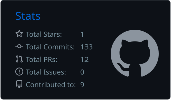
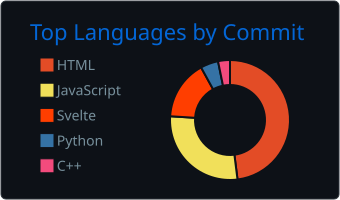

# Paulo de Menezes Gonçalves

### Software Developer focused on Web, Backend & Cybersecurity

I build software for the web — and I'm learning how to secure it.

## About me

&nbsp; Systems Analysis and Development student with completed technical training in IT.

&nbsp; Building web and cross-platform applications with Flutter, Django, and PostgreSQL.

&nbsp; Interested in backend development, APIs, software architecture, automation, and developer tools.

&nbsp; Currently expanding into cybersecurity, ethical hacking, and application security.

## Selected work

### Ministry of Sports data collection platform

`Flutter` · `Django` · `PostgreSQL` · `Hive` · `GoRouter`

**Technology Development Scholar · FADEX / IFSertãoPE**  
*Jun 2025 – Aug 2026*

Contributed to a field data collection platform designed to operate in areas with limited or no connectivity.

- Developed five operational CRUD flows and cross-platform mobile and web interfaces.
- Implemented offline-first data persistence with Hive, including per-user data isolation on shared devices.
- Refactored navigation with GoRouter and the Django/PostgreSQL data model to support many-to-many relationships.
- Performed functional testing, debugging, and authored 27 pages of technical documentation.

<a href="https://paulodemenezesportfolio.vercel.app"><strong>Explore more on my portfolio →</strong></a>

## Tech stack

**Languages**

&nbsp; 

**Frameworks & Development**

&nbsp; 

**Data**

&nbsp; 

**Tools**

&nbsp; 

## Education

**Systems Analysis and Development** — IFSertãoPE  
*2026 – Present*

**Technical Degree in Information Technology** — IFSertãoPE  
*Completed 2026*

## Currently exploring

## GitHub activity

  
  

## Let's connect

Interested in collaborating, discussing a project, or exchanging ideas about software and security? Feel free to reach out.

<a href="https://www.linkedin.com/in/paulomenezesg">LinkedIn</a> ·
<a href="https://paulodemenezesportfolio.vercel.app">Portfolio</a> ·
<a href="mailto:menezespaulo210@gmail.com">Email</a>

 

  Building, testing, and learning in public.

